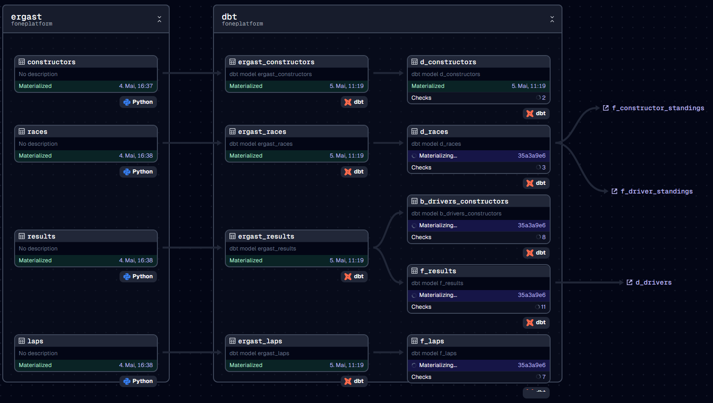

# F1 warehouse with DuckDB

Project with
* Orchestration: [dagster](https://docs.dagster.io/)
* Transformation & Testing: [dbt](https://docs.getdbt.com/)
* Processing Engine & Database: [DuckDB](https://duckdb.org/)
* Data Source: [Ergast API](http://ergast.com/mrd/)

Cutout of the dagster lineage graph:


## Development

* Python >= 3.10 https://www.python.org/downloads/

This project uses `pyproject.toml` to describe package metadata and [uv](https://github.com/astral-sh/uv) to manage dependencies.

### Install uv

https://docs.astral.sh/uv/getting-started/installation/

### Setup environment

Create virtual environment
```bash
uv venv
```

Following command installs Python dependencies:
* The `[dev]` also installs development tools.
* The `--editable` makes the CLI script available.
```bash
uv pip install --editable .[dev]
```

Sync `uv` environment:
```bash
uv sync --extra dev
```

### Activate virtual environment

Bash:
```bash
source .venv/bin/activate
```

Windows:
```powershell
.venv\Scripts\activate
```

### Dagster

Dagster uses environment variables located in [.env](.env).

Start local dagster server
```bash
dagster dev
```

### Dagster CLI

Launch dagster job without
```bash
dagster job execute -m foneplatform -j ergast_job
```

### Development Tools

* Code linting/formatting: `ruff`
* type checking: `mypy`
* SQL linting/formatting: `sqlfluff`


## Environments

Based on the environment variable `ENVIRONMENT` we do:

* `dev`: Locally a `f1.duckdb` database will be created within the `DATA_DIR` (defaults to "data" within project directory)
* `md`: Connects to MotherDuck to store the `f1` database using the `MOTHERDUCK_TOKEN`

Use the `.env` file to set environment variables


## dbt

Install dbt_utils:
```
dbt deps --project-dir="./dbt" --profiles-dir="./dbt"
```

Run models:
```
dbt run --project-dir="./dbt" --profiles-dir="./dbt"
```

Run tests:
```
dbt test --project-dir="./dbt" --profiles-dir="./dbt"
```

### sqlfluff

Run SQL linter on dbt models:
> **_NOTE:_** This may require setting the `DATA_DIR` environment variable to be set to the `data` directory containing the duckdb database.
```
sqlfluff lint ./dbt/models/core
```

## Staging

Staging is done by a Dagster Multi-Asset ([./foneplatform/assets/ergast.py](./foneplatform/assets/ergast.py)):
1. Downloading ZIP of CSV files (http://ergast.com/downloads/f1db_csv.zip)
1. Read CSV using DuckDB and store the asset-result in DuckDB using the `DuckDBDuckDBIOManager`
1. dbt will create models in the same DuckDB database
