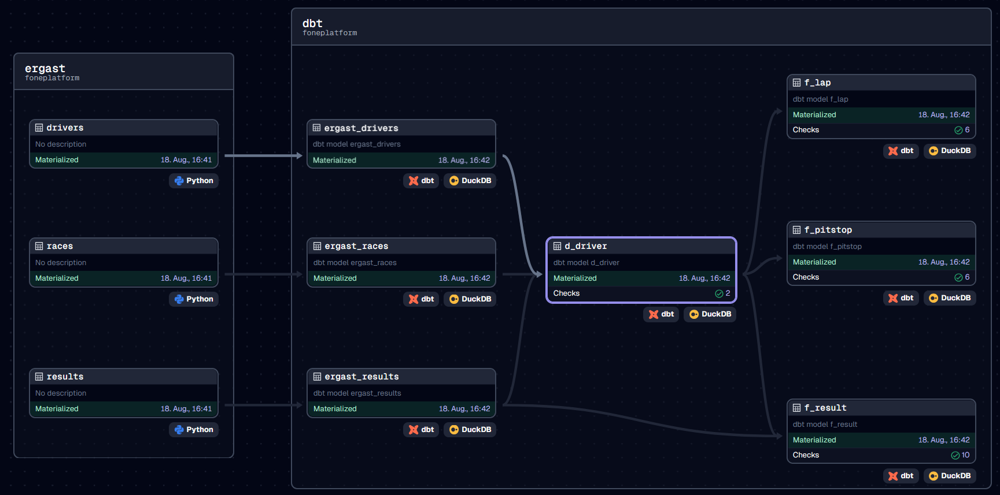

# F1 warehouse with DuckDB

Project with
* Orchestration: [dagster](https://docs.dagster.io/)
* Transformation & Testing: [dbt](https://docs.getdbt.com/)
* Processing Engine & Database: [DuckDB](https://duckdb.org/)
* Data Source: [Ergast API](http://ergast.com/mrd/)

Cutout of the dagster lineage graph:


## Development

* Python >= 3.10 https://www.python.org/downloads/
* pip >= 21.3 (for editable installs, see [PEP 660](https://peps.python.org/pep-0660/))
  * `python -m pip install --upgrade pip`

This project uses `pyproject.toml` to describe package metadata
(see [PEP 621](https://peps.python.org/pep-0621/)).

### Setup Virtual environment

Following commands create and activate a virtual environment.
The `[dev]` also installs development tools.
The `--editable` makes the CLI script available.

* Bash:
    ```bash
    make requirements
    source .venv/bin/activate
    ```
* PowerShell:
    ```powershell
    python -m venv .venv
    .venv\Scripts\Activate.ps1
    python -m pip install --upgrade pip
    pip install --editable .[dev]
    ```
* Windows CMD:
    ```
    python -m venv .venv
    .venv\Scripts\activate.bat
    python -m pip install --upgrade pip
    pip install --editable .[dev]
    ```

### Dagster

Dagster uses environment variables located in [.env](.env).

Start local dagster server
```bash
dagster dev
```

#### Dagster CLI

Launch dagster job without
```bash
dagster job execute -m foneplatform -j ergast_job
```

### Development Tools

* Code linting/formatting: `ruff`
* type checking: `mypy`
* SQL linting/formatting: `sqlfluff`


## File Locations

Ideally the environment variable `DATA_DIR` is set to a location where both the
DuckDB database and the F1 data will be located. Dagster uses `.env` to set the path.

The data directory will look like this:
```
data
├── f1.duckdb
└── ergast
    ├── circuits.parquet
    ├── constructors.parquet
    ├── drivers.parquet
    ...
```

### Staging:

Staging is done by
1. Downloading ZIP of CSV files (http://ergast.com/downloads/f1db_csv.zip)
1. In Dagster asset: Read CSV using DuckDB and store the asset-result as Parquet using the `LocalParquetIOManager`
1. (dbt will create external tables using the Parquet files)

## dbt

Install dbt_utils:
```
dbt deps --project-dir="./dbt" --profiles-dir="./dbt"
```

Run models:
```
dbt run --project-dir="./dbt" --profiles-dir="./dbt"
```

Run tests:
```
dbt test --project-dir="./dbt" --profiles-dir="./dbt"
```

### sqlfluff

Run SQL linter on dbt models:
> **_NOTE:_** This may require setting the `DATA_DIR` environment variable to be set to the `data` directory containing the duckdb database.
```
sqlfluff lint ./dbt/models/core
```
